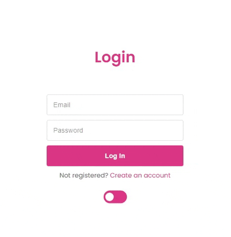

# Login Dark Mode Switch
 This is a simple and flat login page with a dark mode switch included.

## Table of Contents
- <a href="#description">Description</a>
- <a href="#tools-used">Tools Used</a>
- <a href="#layout-preview">Layout Preview</a>
- <a href="#usage-instructions">Usage Instructions</a>
- <a href="#deployment">Deployment</a>
- <a href="#contact">Contact</a>

## Description

This is a simple project with the focus on the dark mode switch.

## Tools Used 

- <a href="https://developer.mozilla.org/pt-BR/docs/Web/HTML" target="_blank">HTML5</a>
- <a href="https://developer.mozilla.org/pt-BR/docs/Web/CSS" target="_blank">CSS3</a>
- <a href="https://developer.mozilla.org/pt-BR/docs/Web/JavaScript" target="_blank">JavaScript</a>

## Layout preview
You can also watch this short preview of how it looks:

<!-- ### Desktop -->

## Usage Instructions
To use the project locally, follow the instructions below:

- Clone this repository to your local machine.
- Open the **index.html** file in a web browser.
- Click on the toggle button to change between dark and light mode.

## Deployment
The project is deployed using GitHub Pages. You can access it by clicking the link below:

<a href="https://wesleysantosdev.github.io/login-dark-mode-switch/" target="_blank">Login Dark Mode Switch</a>

## Contact
If you have any suggestions for this project, feel free to contact me:

- Name: Wesley Santos
- Email: wesleysantosdev@outlook.com
- GitHub: @wesleysantosdev

I hope you enjoy this project!

